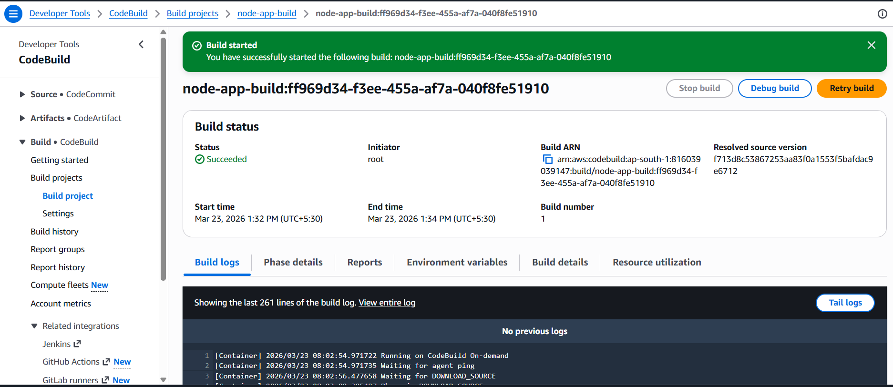
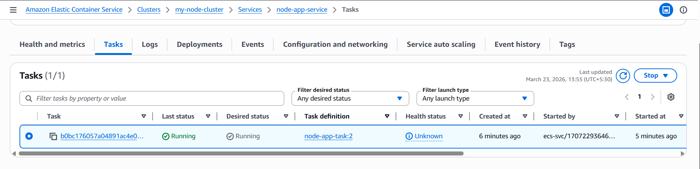
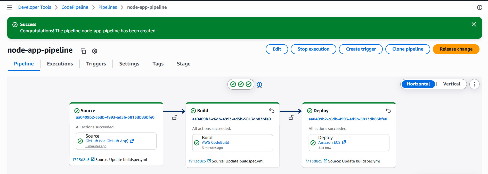
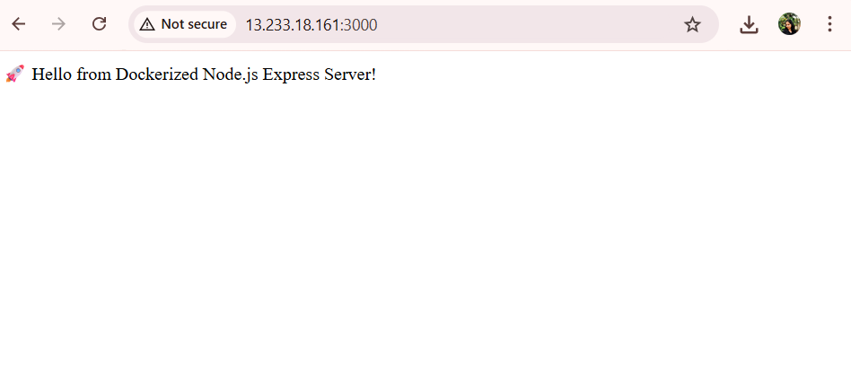

# 🚀 CI/CD Pipeline for Dockerized Node.js App on AWS ECS Fargate

## 📌 Overview
Implemented an end-to-end CI/CD pipeline to automate the build and deployment of a containerized Node.js application using AWS services. The solution enables seamless, zero-touch deployments with a scalable, serverless architecture.

---

## Architecture

GitHub → AWS CodePipeline → AWS CodeBuild → Amazon ECR → Amazon ECS (Fargate)

---

## ⚙️ Tech Stack

- **Backend:** Node.js (Express)
- **Containerization:** Docker
- **CI/CD:** AWS CodePipeline, AWS CodeBuild
- **Container Registry:** Amazon ECR
- **Orchestration:** Amazon ECS
- **Compute:** AWS Fargate
- **Cloud Platform:** AWS

---

## Implementation Details

### 1. Containerization
- Created a Dockerfile using `node:18` base image  
- Configured working directory and exposed port **3000**  
- Pushed source code to GitHub repository  

### 2. Amazon ECR
- Created private repository: `node-app-repo`  
- Enabled image scanning on push  

### 3. Build Automation (CodeBuild)
- Configured project: `node-app-build`  
- Enabled **privileged mode** for Docker builds  
- Used `buildspec.yml` to:
  - Authenticate with ECR  
  - Build Docker image  
  - Tag with commit ID  
  - Push image to ECR  
  - Generate `imagedefinitions.json`  

### 4. ECS Deployment
- **Cluster:** `my-node-cluster`  
- **Task Definition:** `node-app-task`  
  - 0.5 vCPU, 1 GB RAM  
  - Port 3000 mapping  
- **Service:** `node-app-service`  
  - Running 1 task  
  - Public IP enabled  

### 5. CI/CD Pipeline
- **Pipeline Name:** `node-app-pipeline`  
- Stages:
  1. Source (GitHub)  
  2. Build (CodeBuild)  
  3. Deploy (ECS)  

- Automatic deployment triggered on every code push  

---

## CI/CD Workflow

1. Developer pushes code to GitHub  
2. CodePipeline detects changes  
3. CodeBuild builds and pushes Docker image to ECR  
4. ECS service is updated with the new image  
5. Application is redeployed with zero downtime  

---

## 📸 Project Screenshots

### 🔹 CodeBuild - Build Success


### 🔹 ECS - Running Service


### 🔹 CodePipeline - Successful Execution


### 🔹 Live Application


---

## 🌐 Deployment

The application is deployed on AWS ECS Fargate and accessible via:

http://'<public-ip>':3000

---

## Local Setup

```bash
git clone <your-repo-url>
cd <project-folder>
npm install
docker build -t node-app .
docker run -p 3000:3000 node-app
